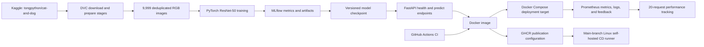

# Cats vs Dogs MLOps Pipeline

> **Fresh local evidence (2026-08-14):** the DVC/MLflow ResNet-50 run completed and the development notebook was re-executed. The M1 numbers below come directly from the generated JSON/text artefacts. The notebook subsequently wrote its best weights to the shared checkpoint, so `dvc status` now reports that output as modified. A fresh container build, CI/GHCR publish, deployment, post-deployment evaluation, screenshots, and submission ZIP are still required before M3-M5 evidence can be claimed for this checkpoint.

End-to-end MLOps implementation for binary image classification, prepared for BITS Pilani WILP M.Tech. AIML, course **AIMLCZG523**, Assignment 2.

> **Semester label:** the requested course folder is `MLOps (S2-25_AIMLCZG523)`, while the header inside the supplied `Problem-Statement.pdf` says `S1-25`. Confirmed by the student as **S2-25**; used consistently below.

## Submission metadata

| Field              | Value                                                                                                                                                                               |
|--------------------|-------------------------------------------------------------------------------------------------------------------------------------------------------------------------------------|
| Student name       | Hamza Aziz                                                                                                                                                                          |
| BITS ID            | 2024AC05133                                                                                                                                                                         |
| Course             | MLOps — AIMLCZG523                                                                                                                                                                  |
| Assignment         | Assignment 2                                                                                                                                                                        |
| Semester tag       | S2-25                                                                                                                                                                               |
| GitHub repository  | https://github.com/hamza-aziz-ai/MLOPs-Cats-Dogs-Pipeline                                                                                                                           |
| GitHub Actions run | Refresh required for the current ResNet-50 checkpoint                                                                                                                               |
| GHCR image         | Refresh required after the current checkpoint is committed and pushed                                                                                                               |


## What this repository delivers

The project turns a from-scratch ResNet-50 image classifier into a reproducible, testable, containerized service:



The workflow is parameterized in `params.yaml`, orchestrated by `dvc.yaml`, tracked locally by MLflow, exercised through automated tests, and packaged with Docker. The last Docker Compose and Prometheus evidence predates the current checkpoint; rebuild and redeploy before treating it as current-model evidence.

The GitHub Actions workflow can publish to GHCR and deploy through a remote self-hosted runner. Its previous live run proved the workflow path, but a fresh run is required for the current ResNet-50 artefact.

## Verified evidence snapshot

| Area                               | Verified result                                                                                                      |
|------------------------------------|----------------------------------------------------------------------------------------------------------------------|
| Dataset source                     | Kaggle handle `tongpython/cat-and-dog`                                                                               |
| Processed dataset                  | 9,999 images at 224 × 224 RGB; 29 duplicate-content images dropped; zero corrupt/skipped images                      |
| Split                              | 6,999 train / 1,999 validation / 1,001 test                                                                          |
| DVC/MLflow training                | `CatDogResNet50`; 70 epochs; 12,576.0645 seconds (3:29:36.064)                                                        |
| DVC test accuracy                  | `0.9450549451`                                                                                                       |
| DVC weighted precision             | `0.9450706068`                                                                                                       |
| DVC weighted recall                | `0.9450549451`                                                                                                       |
| DVC weighted F1                    | `0.9450542870`                                                                                                       |
| MLflow run ID                      | `6b712432dc584f9d9bdadd33d0196536`                                                                                   |
| DVC checkpoint SHA at run end      | `9f118d1f51bffda2079313dd1b4cef0b9f2b8c9e67108e2582d2ea40ae78a128`                                                   |
| Executed notebook                  | 87 cells; 46/46 code cells executed; 260 outputs; zero error outputs; valid nbformat 4.5                              |
| Notebook training/evaluation       | 74 epochs; test accuracy `0.9390609391`; weighted F1 `0.9390554650`; mean ROC-AUC `0.9865239521`                      |
| Current shared checkpoint SHA      | `292fa56f8a0660c2decb32601bb5ca292abb1957436605230161daac233713e7` (written by the notebook after the DVC run)       |
| Automated tests                    | 9 passed; 86% coverage (355 statements, 51 missed)                                                                   |
| Current DVC state                  | `train` output `models/resnet50_baseline.pt` modified by the notebook run                                            |
| Current container/deployment proof | Refresh required: image, CI/GHCR digest, deployment, post-deployment metrics, screenshots, and ZIP were not rerun yet |

The DVC and notebook figures are separate reproducible runs on the same split. They are intentionally reported separately because their checkpoints and test scores differ. Neither result is presented as a production guarantee; transfer learning and broader validation remain in the improvement plan.

## Exact PDF milestone coverage (M1 – M5)

| PDF milestone                                         | Required scope                                                                                                                                      | Repository evidence                                                                                                                                                           | Status                                               |
|-------------------------------------------------------|-----------------------------------------------------------------------------------------------------------------------------------------------------|-------------------------------------------------------------------------------------------------------------------------------------------------------------------------------|------------------------------------------------------|
| **M1 — Model Development & Experiment Tracking**      | Git/DVC, baseline model, MLflow                                                                                                                     | Git-ready source/configuration, `dvc.yaml`, `params.yaml`, download/prepare/train scripts, 70-epoch DVC run, 74-epoch notebook run, MLflow metrics, plots, and checksums      | Complete locally; DVC output modified by notebook    |
| **M2 — Model Packaging & Containerization**           | FastAPI health and predict endpoints, pinned requirements, Docker/local verification                                                                | `src/cats_dogs_mlops/`, `/health`, `/predict`, `requirements-api.txt`, `Dockerfile`, shared preprocessing/checkpoint contract, current API tests                              | Implementation verified; fresh live API check pending |
| **M3 — CI Pipeline for Build, Test & Image Creation** | Unit tests, GitHub Actions, Docker build, GHCR publishing                                                                                           | Nine tests/86% coverage and `.github/workflows/ci-cd.yml`; fresh image build/publish pending                                                                                   | Implementation verified; fresh CI/GHCR run pending   |
| **M4 — CD Pipeline & Deployment**                     | Docker Compose target; main-branch self-hosted Linux runner pulls/deploys image; post-deploy smoke                                                  | `docker-compose.yml` and deployment job configuration; current checkpoint not redeployed                                                                                      | Fresh deployment and smoke evidence pending          |
| **M5 — Monitoring, Logs & Final Submission**          | Request/response logs, Prometheus counters/latency, feedback and performance tracking, source/config/model ZIP, video under five minutes            | Application logging/metrics, `monitoring/prometheus.yml`, evaluator, updated documents, and 4:40 video script; current-model evaluation/ZIP pending                            | Fresh evaluation, screenshots, ZIP, and video pending |

## Repository layout

```text
.
├── .github/workflows/ci-cd.yml       # M3 CI/GHCR and M4 CD workflow
├── artifacts/                        # Learning curves, confusion matrix, metadata
├── data/                             # DVC-managed raw/processed data and manifests
├── metrics/                          # Training and post-deployment metrics
├── models/                           # Serialized model checkpoint
├── monitoring/prometheus.yml         # M5 Prometheus scrape configuration
├── notebooks/01_model_development.ipynb # Executed M1 notebook
├── notebooks/01_model_development.pdf   # 57-page A4 export of the executed notebook
├── runtime/                          # Request feedback output
├── scripts/                          # Download, preparation, training, smoke, evaluation
├── src/cats_dogs_mlops/              # Model, preprocessing, inference, API, logging
├── tests/                            # M3 automated unit/API tests
├── Dockerfile                        # M2 package and M3 image definition
├── docker-compose.yml                # M4 local/target deployment definition
├── dvc.yaml
├── params.yaml
└── requirements.txt
```

## Quick start

### Prerequisites

- Python 3.14 for the local Pipenv/CUDA environment
- Python 3.11 for CI and Docker builds from `requirements*.txt`
- Git
- DVC
- Docker Desktop with Docker Compose v2 for container steps
- Internet access for the public Kaggle dataset on the first DVC run

### 1. Create the environment

```powershell
pipenv install --dev
pipenv shell
```

The local CUDA environment and the Python 3.11 CI/Docker dependency surface are intentionally separate; do not mechanically merge their lock/requirement files.

### 2. Reproduce M1 data and model stages

```powershell
dvc repro
dvc status
```

`dvc repro` executes download, preprocessing, and training according to `dvc.yaml` and `params.yaml`. A successful unchanged run should leave `dvc status` clean.

Inspect the M1 experiment:

```powershell
mlflow ui --backend-store-uri file:./mlruns --port 5000
```

Open `http://127.0.0.1:5000`, select `cats-vs-dogs-baseline`, and locate ResNet-50 run `6b712432dc584f9d9bdadd33d0196536`. Its legacy run name remains `baseline-cnn-1.0.0`; the logged `architecture=CatDogResNet50` parameter is authoritative.

### 3. Run the notebook

```powershell
jupyter nbconvert --execute --to notebook --inplace notebooks\01_model_development.ipynb
```

The checked notebook deliberately uses `RUN_TRAINING = True`. A top-to-bottom execution can train for up to 100 epochs and writes `models/resnet50_baseline.pt`; never run it concurrently with `dvc repro train`.

### 4. Run M3 tests

```powershell
pytest --cov=cats_dogs_mlops --cov-report=term-missing
```

Verified local result on 2026-08-14: **9 tests passed, 86% coverage**.

### 5. Verify the M2 FastAPI package locally

```powershell
uvicorn cats_dogs_mlops.api:app --host 0.0.0.0 --port 8000
```

In a second terminal:

```powershell
Invoke-RestMethod http://localhost:8000/health
curl.exe -X POST -F "image=@C:\path\to\sample.jpg" http://localhost:8000/predict
Invoke-WebRequest http://localhost:8000/metrics | Select-Object -ExpandProperty Content
```

Do not upload sensitive images. The API accepts an image, applies the same deterministic inference transform used during evaluation, and returns the predicted class and confidence.

### 6. Build the M3 image and verify the M4 Compose deployment

```powershell
docker build -t cats-dogs-mlops:local .
docker compose up --build -d
docker compose ps
Invoke-RestMethod http://localhost:8000/health
docker compose down
```

The previous image/Compose verification predates the current notebook checkpoint. Rebuild the image, start Compose, and rerun health/smoke checks before recording current-model evidence.

### 7. Run M5 post-deployment performance tracking

With the API and Prometheus running:

```powershell
python scripts/post_deployment_evaluation.py --base-url http://localhost:8000
```

`metrics/post_deployment_metrics.json` still contains a historical 20-request result from the retired deployment. Rerun this command after rebuilding and redeploying the current checkpoint; no current-model deployment metric is claimed here yet.

## M3 CI/GHCR and M4 CD boundary

`.github/workflows/ci-cd.yml` defines two distinct responsibilities:

- **M3 CI:** run unit tests, build the Docker image, and publish it to GHCR under the configured conditions.
- **M4 CD:** on the main branch, a trusted Linux x64 self-hosted runner pulls the published image, deploys the Docker Compose target, and performs the post-deployment smoke check.

For a real remote run:

1. Commit and push the verified current checkpoint and evidence only when explicitly authorized.
2. Confirm Actions permissions include `contents: read` and `packages: write`.
3. Register a fresh trusted Linux x64 self-hosted runner before the deployment job.
4. Run M3 and retain the new CI run URL.
5. Verify GHCR and record the new immutable image digest.
6. Retain the new deployment job URL plus remote health, prediction, Compose, Prometheus, and smoke evidence.

The M4 job needs a self-hosted Linux runner because Docker Compose must operate on the persistent target host. A GitHub-hosted runner is ephemeral and cannot be treated as that persistent deployment target. Never attach an untrusted self-hosted runner to a public repository or expose secrets in logs.

An earlier GitHub Actions/GHCR/self-hosted deployment proved the workflow path, but it contains the retired model artefact. New URLs, digest, and screenshots are required for the current ResNet-50 checkpoint.

## M5 monitoring, logs, and final package

The service records request/response activity, exports Prometheus counters and latency observations, and supports prediction feedback. The evaluator measures deployed correctness and latency, but the current checkpoint has not yet been rebuilt into the image or re-evaluated through the HTTP service.

The final submission must additionally include:

- Source/config/model ZIP: rebuild after the fresh artefacts, documents, screenshots, and final commit are ready; record the new filename, size, file count, and SHA-256.
- **[VIDEO URL OR FILENAME — UNDER FIVE MINUTES]**
- **[SCREENSHOTS: DVC, MLFLOW, TESTS, IMAGE BUILD, COMPOSE, PROMETHEUS, ACTIONS/GHCR/REMOTE DEPLOY]**

Do not put secrets, the virtual environment, unnecessary raw data, or private runtime logs in the ZIP.

## Baseline limitations and next improvement

The DVC run's test accuracy (`0.9450549451`) and weighted F1 (`0.9450542870`), together with the notebook run's test accuracy (`0.9390609391`), show strong held-out performance on this curated two-class split. They do not establish robustness beyond this dataset. The best next experiment is transfer learning with a pretrained MobileNetV3 or EfficientNet backbone:

- freeze the backbone for an initial head-training phase;
- fine-tune the final blocks at a lower learning rate;
- log both runs to MLflow under identical data splits;
- compare per-class metrics, calibration, latency, and model size;
- promote the new checkpoint only if it improves a predeclared acceptance gate.

`notebooks/01_model_development.ipynb` implements `CatDogResNet50` from scratch (a stem plus four residual stages containing 16 bottleneck blocks) as the project's actual baseline model, trained on this project's `data/processed` split. It is randomly initialized, not pretrained on ImageNet — genuine transfer learning with pretrained weights remains the recommended next step, not this notebook itself.

Other limitations include dataset bias, the closed two-class assumption, lack of out-of-distribution rejection, and aggregate metrics hiding class-specific errors.

## Submission documents

- `SUBMISSION_REPORT.md` — academic narrative, architecture, results, and exact PDF M1–M5 evidence
- `SUBMISSION_CHECKLIST.md` — verified items versus manual/live submission work
- `VIDEO_DEMO_SCRIPT.md` — timestamped demonstration plan under five minutes

Before submission, replace every bracketed placeholder and attach the screenshots listed in the checklist. Do not replace placeholders with invented URLs or evidence.
