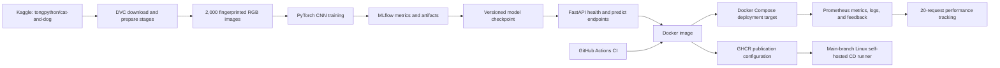

# Cats vs Dogs MLOps Pipeline

End-to-end MLOps implementation for binary image classification, prepared for BITS Pilani WILP M.Tech. AIML, course **AIMLCZG523**, Assignment 2.

> **Semester label:** the requested course folder is `MLOps (S2-25_AIMLCZG523)`, while the header inside the supplied `Problem-Statement.pdf` says `S1-25`. Confirmed by the student as **S2-25**; used consistently below.

## Submission metadata

| Field | Value |
|---|---|
| Student name | Hamza Aziz |
| BITS ID | 2024AC05133 |
| Course | MLOps — AIMLCZG523 |
| Assignment | Assignment 2 |
| Semester tag | S2-25 |
| Problem statement | `Problem-Statement.pdf` in the Assignment-2 course folder |
| GitHub repository | `https://github.com/hamza-aziz-ai/MLOPs-Cats-Dogs-Pipeline` |
| GitHub Actions run | `https://github.com/hamza-aziz-ai/MLOPs-Cats-Dogs-Pipeline/actions/runs/31706209711` |
| GHCR image | `https://github.com/hamza-aziz-ai/MLOPs-Cats-Dogs-Pipeline/pkgs/container/mlops-cats-dogs-pipeline`, digest `sha256:8d6f10f8f231fe565944b5b4bd9bddd0a9a946438c879ccc8572d80578e2e0bf` |
| Submission ZIP | `cats-dogs-mlops-submission.zip`, sha256 `7ad90ed21ed6696cb90f598a1ec9a6c6fd6675b36e317858648cf54e688dbc4d` |

## What this repository delivers

The project turns a small convolutional neural network into a reproducible, testable, containerized service:



The workflow is parameterized in `params.yaml`, orchestrated by `dvc.yaml`, tracked locally by MLflow, exercised through automated tests, and packaged with Docker. The final local Docker Compose stack was verified with both containers healthy, and the Prometheus target `http://api:8000/metrics` reported `up`.

The GitHub Actions workflow publishes to GHCR and deploys through a remote self-hosted runner — both verified live, see the Submission metadata table above for the run URL and digest.

## Verified evidence snapshot

| Area | Verified result |
|---|---|
| Dataset source | Kaggle handle `tongpython/cat-and-dog` |
| Processed dataset | 2,000 images, 224 × 224 RGB, zero corrupt files |
| Split | 1,600 train / 200 validation / 200 test |
| Training | Baseline CNN, 5 epochs |
| Test accuracy | `0.62` |
| Weighted precision | `0.6428571429` |
| Weighted recall | `0.62` |
| Weighted F1 | `0.6041666667` |
| MLflow run ID | `e040fb0dbc64492f96eea1affa576c90` |
| Model SHA-256 | `8070fc046c4e247d30fa0ec469cd2fd22c1205070c9ddde4121ba540bcc0a793` |
| Deployed evaluation batch | 20 labelled requests |
| Deployed accuracy / weighted F1 | `0.7` / `0.6969696970` |
| Serving latency | mean `58.9655750 ms`; p95 `85.8087000 ms` |
| Automated tests | 8 passed; 83% coverage |
| Container image | Docker image built locally |
| Local deployment | Docker Compose API and Prometheus containers both healthy; target `http://api:8000/metrics` is `up`; post-deploy smoke passed |
| Notebook | 34 cells; 14 code cells executed; 0 error outputs |
| DVC | `dvc status` clean |

These numbers describe a working baseline, not a state-of-the-art classifier. The moderate test score is reported honestly and motivates transfer learning in the improvement plan.

## Exact PDF milestone coverage (M1–M5)

| PDF milestone | Required scope | Repository evidence | Status |
|---|---|---|---|
| **M1 — Model Development & Experiment Tracking** | Git/DVC, baseline model, MLflow | Git-ready source/configuration, `dvc.yaml`, `params.yaml`, download/prepare/train scripts, five-epoch CNN, executed notebook, MLflow run, metrics, plots, checkpoint checksum | Complete locally |
| **M2 — Model Packaging & Containerization** | FastAPI health and predict endpoints, pinned requirements, Docker/local verification | `src/cats_dogs_mlops/`, `/health`, `/predict`, `requirements-api.txt`, `Dockerfile`, shared preprocessing and checkpoint contract | Complete locally |
| **M3 — CI Pipeline for Build, Test & Image Creation** | Unit tests, GitHub Actions, Docker build, GHCR publishing | Eight tests/83% coverage, `.github/workflows/ci-cd.yml`, verified local image build, live GHCR publication | Complete — live Actions run and GHCR digest verified |
| **M4 — CD Pipeline & Deployment** | Docker Compose target; main-branch self-hosted Linux runner pulls/deploys image; post-deploy smoke | `docker-compose.yml`; main-branch self-hosted Linux deployment job; live two-container healthy stack; live post-deploy smoke | Complete — live remote runner deployment verified |
| **M5 — Monitoring, Logs & Final Submission** | Request/response logs, Prometheus counters/latency, feedback and 20-request performance tracking, source/config/model ZIP, video under five minutes | Application logging/metrics, `monitoring/prometheus.yml`, feedback path, post-deployment evaluator/results, report/checklist, 4:40 video script, checksummed ZIP | Complete except final video recording |

## Repository layout

```text
.
├── .github/workflows/ci-cd.yml       # M3 CI/GHCR and M4 CD workflow
├── artifacts/                        # Learning curves, confusion matrix, metadata
├── data/                             # DVC-managed raw/processed data and manifests
├── metrics/                          # Training and post-deployment metrics
├── models/                           # Serialized model checkpoint
├── monitoring/prometheus.yml         # M5 Prometheus scrape configuration
├── notebooks/01_model_development.ipynb
├── runtime/                          # Request feedback output
├── scripts/                          # Download, preparation, training, smoke, evaluation
├── src/cats_dogs_mlops/              # Model, preprocessing, inference, API, logging
├── tests/                            # M3 automated unit/API tests
├── Dockerfile                        # M2 package and M3 image definition
├── docker-compose.yml                # M4 local/target deployment definition
├── dvc.yaml
├── params.yaml
└── requirements.txt
```

## Quick start

### Prerequisites

- Python 3.11 or 3.12
- Git
- DVC
- Docker Desktop with Docker Compose v2 for container steps
- Internet access for the public Kaggle dataset on the first DVC run

### 1. Create the environment

```powershell
py -3.12 -m venv .venv
.\.venv\Scripts\Activate.ps1
python -m pip install --upgrade pip
python -m pip install -r requirements.txt
python -m pip install -e .
```

Python 3.11 may be used instead of 3.12. Keep one version consistent across local execution, CI, and screenshots.

### 2. Reproduce M1 data and model stages

```powershell
dvc repro
dvc status
```

`dvc repro` executes download, preprocessing, and training according to `dvc.yaml` and `params.yaml`. A successful unchanged run should leave `dvc status` clean.

Inspect the M1 experiment:

```powershell
mlflow ui --backend-store-uri file:./mlruns --port 5000
```

Open `http://127.0.0.1:5000`, select `cats-vs-dogs-baseline`, and locate run `e040fb0dbc64492f96eea1affa576c90`.

### 3. Run the notebook

```powershell
jupyter nbconvert --execute --to notebook --inplace notebooks\01_model_development.ipynb
```

The checked notebook uses `RUN_TRAINING = False` and inspects existing canonical artifacts. Set it to `True` only when deliberately launching a new experiment.

### 4. Run M3 tests

```powershell
pytest --cov=cats_dogs_mlops --cov-report=term-missing
```

Verified local result: **8 tests passed, 83% coverage**.

### 5. Verify the M2 FastAPI package locally

```powershell
uvicorn cats_dogs_mlops.api:app --host 0.0.0.0 --port 8000
```

In a second terminal:

```powershell
Invoke-RestMethod http://localhost:8000/health
curl.exe -X POST -F "image=@C:\path\to\sample.jpg" http://localhost:8000/predict
Invoke-WebRequest http://localhost:8000/metrics | Select-Object -ExpandProperty Content
```

Do not upload sensitive images. The API accepts an image, applies the same deterministic inference transform used during evaluation, and returns the predicted class and confidence.

### 6. Build the M3 image and verify the M4 Compose deployment

```powershell
docker build -t cats-dogs-mlops:local .
docker compose up --build -d
docker compose ps
Invoke-RestMethod http://localhost:8000/health
docker compose down
```

Verified local result: the image built, both Compose containers were healthy, Prometheus reported target `http://api:8000/metrics` as `up`, and the post-deployment smoke passed.

### 7. Run M5 post-deployment performance tracking

With the API and Prometheus running:

```powershell
python scripts/post_deployment_evaluation.py --base-url http://localhost:8000
```

The verified 20-request batch produced accuracy `0.7`, weighted F1 `0.6969696970`, mean latency `58.9655750 ms`, and p95 latency `85.8087000 ms`.

## M3 CI/GHCR and M4 CD boundary

`.github/workflows/ci-cd.yml` defines two distinct responsibilities:

- **M3 CI:** run unit tests, build the Docker image, and publish it to GHCR under the configured conditions.
- **M4 CD:** on the main branch, a trusted Linux x64 self-hosted runner pulls the published image, deploys the Docker Compose target, and performs the post-deployment smoke check.

For a real remote run:

1. Push the final repository to GitHub. — done: `https://github.com/hamza-aziz-ai/MLOPs-Cats-Dogs-Pipeline`
2. Confirm Actions permissions include `contents: read` and `packages: write`. — confirmed in `.github/workflows/ci-cd.yml`'s per-job `permissions` blocks.
3. Run M3 and retain the CI run URL. — `https://github.com/hamza-aziz-ai/MLOPs-Cats-Dogs-Pipeline/actions/runs/31706209711`
4. Verify GHCR and record the image URL plus immutable digest. — `https://github.com/hamza-aziz-ai/MLOPs-Cats-Dogs-Pipeline/pkgs/container/mlops-cats-dogs-pipeline`, `sha256:8d6f10f8f231fe565944b5b4bd9bddd0a9a946438c879ccc8572d80578e2e0bf`
5. Configure the M4 job only on a trusted Linux x64 self-hosted runner with Docker and Docker Compose installed. — done: WSL2 Ubuntu 24.04, repo-scoped runner.
6. Retain the deployment job URL and remote health/smoke evidence. — `https://github.com/hamza-aziz-ai/MLOPs-Cats-Dogs-Pipeline/actions/runs/31706209711/job/94470326140`; remote `/health` returned `{"status":"ready","model_loaded":true}`, remote `/predict` on a real cat image returned `{"label":"cats","confidence":0.582}`.

The M4 job needs a self-hosted Linux runner because Docker Compose must operate on the persistent target host. A GitHub-hosted runner is ephemeral and cannot be treated as that persistent deployment target. Never attach an untrusted self-hosted runner to a public repository or expose secrets in logs.

GitHub Actions has published to GHCR and a remote self-hosted deployment has run — see the run/job URLs and digest above. Screenshots remain separate submission-time evidence.

## M5 monitoring, logs, and final package

The service records request/response activity, exports Prometheus counters and latency observations, and supports prediction feedback. The final local Compose verification showed both containers healthy and the Prometheus target `http://api:8000/metrics` reporting `up`. The 20-request evaluator measures deployed correctness and latency.

The final submission must additionally include:

- Source/config/model ZIP: `cats-dogs-mlops-submission.zip`, sha256 `7ad90ed21ed6696cb90f598a1ec9a6c6fd6675b36e317858648cf54e688dbc4d`.
- **[VIDEO URL OR FILENAME — UNDER FIVE MINUTES]**
- **[SCREENSHOTS: DVC, MLFLOW, TESTS, IMAGE BUILD, COMPOSE, PROMETHEUS, ACTIONS/GHCR/REMOTE DEPLOY]**

Do not put secrets, the virtual environment, unnecessary raw data, or private runtime logs in the ZIP.

## Baseline limitations and next improvement

The baseline's test accuracy (`0.62`) and weighted F1 (`0.6041666667`) show that the pipeline works but the scratch CNN is not yet a strong classifier. The best next experiment is transfer learning with a pretrained MobileNetV3 or EfficientNet backbone:

- freeze the backbone for an initial head-training phase;
- fine-tune the final blocks at a lower learning rate;
- log both runs to MLflow under identical data splits;
- compare per-class metrics, calibration, latency, and model size;
- promote the new checkpoint only if it improves a predeclared acceptance gate.

`notebooks/ResNet-Implementation_COPY.ipynb` implements this repository's own from-scratch ResNet-50 (identity/convolutional blocks, all 5 stages) as a companion exploration, trained on this project's `data/processed` split. It is **not** the transfer-learning improvement above — it's randomly initialized, not pretrained — so it doesn't by itself solve the accuracy gap; genuine transfer learning with pretrained ImageNet weights remains the recommended next step.

Other limitations include dataset bias, the closed two-class assumption, lack of out-of-distribution rejection, and aggregate metrics hiding class-specific errors.

## Submission documents

- `SUBMISSION_REPORT.md` — academic narrative, architecture, results, and exact PDF M1–M5 evidence
- `SUBMISSION_CHECKLIST.md` — verified items versus manual/live submission work
- `VIDEO_DEMO_SCRIPT.md` — timestamped demonstration plan under five minutes

Before submission, replace every bracketed placeholder and attach the screenshots listed in the checklist. Do not replace placeholders with invented URLs or evidence.
