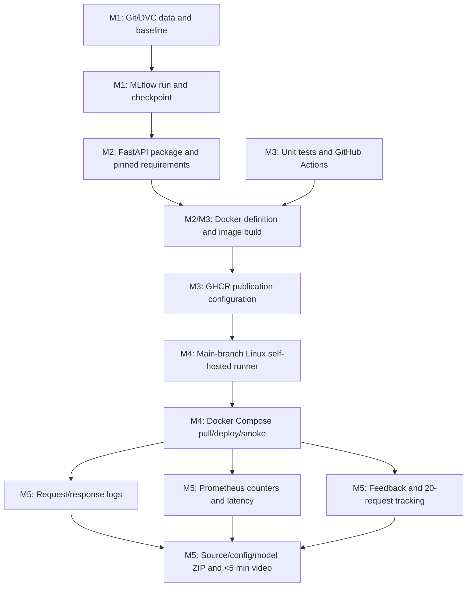

# Assignment 2 Submission Report — End-to-End MLOps Pipeline

> **Evidence status (2026-08-14):** local data, DVC/MLflow, notebook, checkpoint, and test numbers have been refreshed from the completed ResNet-50 artefacts. The notebook briefly overwrote the shared checkpoint with its own raw-state-dict weights; the DVC run's checkpoint (`9f118d1f...`) has since been restored as the sole production artifact and `dvc status` reports the pipeline clean. The notebook is now write-protected — it saves to `artifacts/resnet50/resnet50_notebook_checkpoint.pt` and can no longer touch `models/resnet50_baseline.pt`. CI/GHCR, deployment, post-deployment, screenshot, ZIP, and final-commit evidence has not yet been regenerated for this checkpoint and is marked pending below.

## Cover information

| Field             | Submission value                                                                                                                                                                     |
|-------------------|--------------------------------------------------------------------------------------------------------------------------------------------------------------------------------------|
| Student name      | Hamza Aziz                                                                                                                                                                           |
| BITS ID           | 2024AC05133                                                                                                                                                                          |
| Programme         | BITS Pilani WILP M.Tech. Artificial Intelligence and Machine Learning                                                                                                                |
| Course            | MLOps — AIMLCZG523                                                                                                                                                                   |
| Assignment        | Assignment 2                                                                                                                                                                         |
| Semester tag      | S2-25                                                                                                                                                                                |
| GitHub repository | https://github.com/hamza-aziz-ai/MLOPs-Cats-Dogs-Pipeline                                                                                                                            |
| CI run            | Pending fresh run for the current ResNet-50 checkpoint                                                                                                                               |
| Container image   | Pending fresh build/publish and immutable digest                                                                                                                                     |

## 1. Source and scope

The authoritative task source used for this implementation is:

`Semester-3/MLOps (S2-25_AIMLCZG523)/Assignments/Assignment-2/Problem-Statement.pdf`

There is a semester-label discrepancy: the course folder and request identify **S2-25**, while the PDF header identifies **S1-25**. The technical work follows the supplied problem statement. Confirmed by the student as **S2-25**; used consistently across the cover page, Git tag, and LMS upload name.

This report documents an end-to-end Cats vs Dogs MLOps baseline and follows the PDF's milestone structure exactly:

1. **M1 — Model Development & Experiment Tracking**
2. **M2 — Model Packaging & Containerization**
3. **M3 — CI Pipeline for Build, Test & Image Creation**
4. **M4 — CD Pipeline & Deployment**
5. **M5 — Monitoring, Logs & Final Submission**

## 2. Executive summary

The completed local pipeline processed 9,999 public images into deterministic class partitions at 224 × 224 RGB resolution after dropping 29 duplicate-content images and skipping zero corrupt files. The DVC/MLflow `CatDogResNet50` run stopped after 70 epochs and achieved held-out test accuracy `0.9450549451` with weighted F1 `0.9450542870`. It is tied to MLflow run `6b712432dc584f9d9bdadd33d0196536`; its checkpoint SHA-256 at run completion was `9f118d1f51bffda2079313dd1b4cef0b9f2b8c9e67108e2582d2ea40ae78a128`.

The development notebook was then executed independently for 74 epochs and achieved test accuracy `0.9390609391`, weighted F1 `0.9390554650`, mean average precision `0.9867129639`, and mean ROC-AUC `0.9865239521`. It briefly wrote its raw weights (SHA-256 `292fa56f8a0660c2decb32601bb5ca292abb1957436605230161daac233713e7`) over the shared checkpoint; that has since been reverted, the DVC checkpoint (`9f118d1f...`) is now the sole production artifact, and the notebook is write-protected against `models/resnet50_baseline.pt` going forward — it now saves to `artifacts/resnet50/resnet50_notebook_checkpoint.pt`. All 46 code cells executed with zero error outputs. Nine automated tests now pass with 86% coverage.

The outcome is a functioning local MLOps pipeline with fresh M1 evidence. The prior CI/CD and deployment run proved the workflow path but packaged the retired model, so a fresh image, GHCR digest, deployment, post-deployment evaluation, screenshots, and ZIP are required before M3-M5 can be signed off for this checkpoint.

## 3. Problem definition

The machine-learning task is closed-set binary image classification:

\[
f(x;\theta) \rightarrow \{\text{cats},\text{dogs}\}.
\]

For output logits \(\mathbf{z}\), softmax gives:

\[
p(y=c\mid x)=\frac{e^{z_c}}{\sum_j e^{z_j}},
\]

and training minimizes cross-entropy:

\[
\mathcal{L}(x,y)=-\log p(y\mid x).
\]

The engineering goal is broader than one score: data, code, configuration, experiments, model artefacts, packaging, CI, deployment, monitoring, logs, and final evidence must be traceable and repeatable.

## 4. Architecture and milestone flow



Key decision: preprocessing and checkpoint metadata are shared between offline and online paths. This reduces training-serving skew and makes the artefact self-describing through class names, image size, model version, metrics, and checksum.

## 5. M1 — Model Development & Experiment Tracking

M1 covers Git/DVC, the baseline model, and MLflow.

### 5.1 Dataset source and provenance

- Dataset handle: `tongpython/cat-and-dog`
- Download implementation: `scripts/download_data.py`
- Reproducibility: `dvc.yaml` and `params.yaml`
- Current DVC state: `models/resnet50_baseline.pt` is the restored DVC `train` output; `dvc status` reports the pipeline clean

The preparation stage verifies decodability, applies orientation correction, converts to RGB, centre-crops without stretching, resizes to 224 × 224, and stores an SHA-256 content fingerprint in the manifest.

| Property                  | Value      |
|---------------------------|------------|
| Total images              | 9,999      |
| Training                  | 6,999      |
| Validation                | 1,999      |
| Test                      | 1,001      |
| Image format              | RGB        |
| Resolution                | 224 × 224  |
| Corrupt images skipped    | 0          |
| Duplicate content dropped | 29         |

The split is deterministic and stratified by class. The manifest supports source-path and content-hash leakage checks.

### 5.2 Transform contract

Training applies random resized crop, horizontal flip, and mild colour jitter. Validation, test, and inference use deterministic resizing. All paths use the same normalization:

\[
x'=\frac{x-0.5}{0.5}.
\]

The notebook asserts the `(3, 224, 224)` tensor contract.

### 5.3 Baseline CNN and training

`CatDogResNet50` (`src/cats_dogs_mlops/model.py`) is a from-scratch ResNet-50: a 7x7 stem, four residual stages built from convolutional and identity blocks with skip connections (16 bottleneck blocks total), average pooling, and a 3-layer fully connected head to raw logits for cross-entropy loss. It is randomly initialized and uses no pretrained weights.

| Parameter                    | Value         |
|------------------------------|---------------|
| Epoch budget                 | 100           |
| DVC epochs completed         | 70     -      |
| Notebook epochs completed    | 74            |
| Image size                   | 224           |
| Batch size                   | 32            |
| Learning rate                | 0.001         |
| Weight decay                 | 0.0001        |
| Early-stopping patience      | 20            |
| Early-stopping minimum delta | 0.01          |
| Optimizer                    | AdamW         |
| Loss                         | Cross-entropy |
| Seed                         | 42            |

### 5.4 MLflow and held-out results

| Evidence                                           | Value                                                                |
|----------------------------------------------------|----------------------------------------------------------------------|
| Experiment                                         | `cats-vs-dogs-baseline`                                              |
| Run ID                                             | `6b712432dc584f9d9bdadd33d0196536`                                   |
| Architecture parameter                             | `CatDogResNet50`                                                     |
| Model version                                      | `1.0.0`                                                              |
| DVC checkpoint SHA (current production)            | `9f118d1f51bffda2079313dd1b4cef0b9f2b8c9e67108e2582d2ea40ae78a128`   |
| Notebook checkpoint SHA (experimental, superseded) | `292fa56f8a0660c2decb32601bb5ca292abb1957436605230161daac233713e7`   |
| DVC training duration                              | 12,576.0645 seconds (3:29:36.064)                                    |

| Metric             | Value        |
|--------------------|--------------|
| Accuracy           | 0.9450549451 |
| Weighted precision | 0.9450706068 |
| Weighted recall    | 0.9450549451 |
| Weighted F1        | 0.9450542870 |

MLflow records parameters, dataset sizes, device, class ordering, code revision where available, epoch metrics, final metrics, training duration, plots, checkpoint, metrics JSON, and model metadata.

### 5.5 Notebook evidence

`notebooks/01_model_development.ipynb` covers problem understanding, mathematics, provenance, split/leakage checks, preprocessing visualization, model/output checks, training, artefact inspection, evaluation, and limitations. Verified status: **87 cells, 46 code cells, 46 executed code cells, 260 outputs, zero error outputs, valid nbformat 4.5**. `RUN_TRAINING=True`; the run stopped after 74 epochs. Its test accuracy is `0.9390609391`, weighted precision `0.9392018668`, weighted recall `0.9390609391`, weighted F1 `0.9390554650`, mean average precision `0.9867129639`, and mean ROC-AUC `0.9865239521`. The confusion matrix is `[[465, 35], [26, 475]]` for true cats/dogs by predicted cats/dogs. The exported notebook PDF has 57 A4 pages.

## 6. M2 — Model Packaging & Containerization

M2 covers FastAPI health and predict endpoints, pinned requirements, and Docker/local package verification.

The service loads the trusted checkpoint, uses the shared deterministic preprocessing path, and exposes:

- `/health` for readiness;
- `/predict` for multipart image classification using form field `image`;
- `/metrics` for M5 Prometheus scraping;
- feedback behaviour for M5 performance tracking.

The checkpoint loader validates required metadata and uses a weights-only load path. `requirements-api.txt` pins the serving dependencies, while `Dockerfile` defines the repeatable application image.

Local API verification commands:

```powershell
uvicorn cats_dogs_mlops.api:app --host 0.0.0.0 --port 8000
Invoke-RestMethod http://localhost:8000/health
curl.exe -X POST -F "image=@C:\path\to\sample.jpg" http://localhost:8000/predict
```

Do not upload sensitive images.

## 7. M3 — CI Pipeline for Build, Test & Image Creation

M3 covers unit tests, GitHub Actions, Docker image creation, and GHCR publishing.

Verified local evidence:

- Tests passed: **9**
- Coverage: **86%** (355 statements, 51 missed)
- Docker image build for the current checkpoint: pending
- GitHub Actions workflow: present at `.github/workflows/ci-cd.yml`
- GHCR publishing path: configured; fresh current-checkpoint push pending

The workflow defines automated quality gates and image creation/publication under its configured events and permissions. The previous live run and digest belonged to the retired model and are not current ResNet-50 evidence. Required fresh M3 evidence:

- GitHub repository: `https://github.com/hamza-aziz-ai/MLOPs-Cats-Dogs-Pipeline`
- Successful GitHub Actions run: **pending**
- GHCR image: `https://github.com/hamza-aziz-ai/MLOPs-Cats-Dogs-Pipeline/pkgs/container/mlops-cats-dogs-pipeline`
- GHCR immutable digest for the current checkpoint: **pending**
- **[SCREENSHOT: TEST/BUILD/PUBLISH JOBS PASSING]**

Coverage is a useful gate but not proof of correctness. Future tests should add corrupt input, load failure, concurrency, resource limits, and rollback behaviour.

## 8. M4 — CD Pipeline & Deployment

M4 covers the Docker Compose target and the main-branch Linux self-hosted runner that pulls/deploys the image and performs a post-deployment smoke check.

M4 implementation evidence:

- `docker-compose.yml` defines the deployment target.
- A fresh Compose deployment of the current checkpoint is pending.
- A fresh Prometheus target check and post-deployment smoke result are pending.

The workflow's remote M4 path is configured for a trusted Linux x64 self-hosted runner on the main branch. That runner pulls the published image, deploys it with Docker Compose, and runs the smoke check. A GitHub-hosted runner is ephemeral and cannot be treated as the persistent target host.

Required fresh remote M4 evidence:

- Self-hosted runner: register a fresh trusted Linux runner with labels `self-hosted`/`linux`.
- **[SELF-HOSTED RUNNER SCREENSHOT]**
- Successful main-branch deployment job: **pending**
- Deployed image digest matching the fresh M3 build: **pending**
- Remote Compose, Prometheus, `/health`, and genuine `/predict` evidence: **pending**
- **[REMOTE COMPOSE STATUS AND HEALTH/SMOKE SCREENSHOT]**
- Deployment host note: private host — student's own WSL2 Ubuntu self-hosted runner, `http://localhost:8000`, not publicly routable.

The runner is trusted, patched, restricted to the intended repository, and not exposed to untrusted pull-request code or secrets.

## 9. M5 — Monitoring, Logs & Final Submission

M5 covers request/response logs, Prometheus counters/latency, feedback and 20-request performance tracking, the source/config/model ZIP, and a video shorter than five minutes.

### 9.1 Monitoring and logs

The service records request/response activity, exports Prometheus-compatible counters and latency observations, exposes health state, and supports feedback persistence. `monitoring/prometheus.yml` scrapes `http://api:8000/metrics` inside the Compose network. Fresh current-checkpoint Compose and Prometheus evidence is pending.

Recommended panels/alerts include request rate, error rate, mean/p95/p99 latency, confidence/class distribution, invalid-image rate, active model version/checksum, feedback coverage, delayed accuracy, container restarts, CPU, and memory.

### 9.2 Post-deployment performance tracking

| Metric            | Current checkpoint value            |
|-------------------|-------------------------------------|
| Labelled requests | Pending fresh deployment evaluation |
| Accuracy          | Pending                             |
| Weighted F1       | Pending                             |
| Mean latency      | Pending                             |
| P95 latency       | Pending                             |

The existing `metrics/post_deployment_metrics.json` is retained as historical evidence from the retired deployment and must not be compared with the fresh offline ResNet-50 metrics. Rerun the evaluator after the new image is deployed; even then, a small request batch is only a smoke-level estimate, not a production guarantee.

### 9.3 Final submission package

This report is updated. Still to regenerate:

- source, configuration, and current model artefact ZIP, including its new file count, size, and SHA-256;
- identity and semester confirmation: Hamza Aziz, 2024AC05133, S2-25;
- live M3/M4 URLs and the current image digest.

Still required: the final video recording under five minutes, refreshed screenshots, fresh deployment evidence, and the rebuilt ZIP.

Do not include secrets, `.env`, `.venv`, unnecessary raw data, private logs, or cached dependencies in the ZIP.

## 10. Exact M1–M5 evidence matrix

| PDF milestone                                         | Evidence delivered                                                                                                                                                                          | Verified status                                                                               | Manual/live evidence still required                       |
|-------------------------------------------------------|---------------------------------------------------------------------------------------------------------------------------------------------------------------------------------------------|-----------------------------------------------------------------------------------------------|-----------------------------------------------------------|
| **M1 — Model Development & Experiment Tracking**      | Git-ready source; DVC pipeline; 9,999-image provenance; 70-epoch DVC/MLflow run; 74-epoch notebook run; metrics/plots/checkpoints                                                           | Complete locally; DVC checkpoint restored as sole production artifact, `dvc status` clean     | Refresh DVC/MLflow/notebook screenshots                   |
| **M2 — Model Packaging & Containerization**           | FastAPI `/health` and `/predict`; shared inference contract; pinned API requirements; Dockerfile; current API tests                                                                         | Implementation verified                                                                       | Fresh current-checkpoint API/package check and screenshot |
| **M3 — CI Pipeline for Build, Test & Image Creation** | Nine tests/86% coverage; GitHub Actions workflow; Docker/GHCR path                                                                                                                          | Local tests current; fresh image, CI run, and digest pending                                  | Fresh CI/GHCR screenshots                                 |
| **M4 — CD Pipeline & Deployment**                     | Compose target and main-branch Linux self-hosted deploy/smoke workflow                                                                                                                      | Current checkpoint not redeployed                                                             | Runner, deployment, health, and smoke evidence            |
| **M5 — Monitoring, Logs & Final Submission**          | Request/response logging; Prometheus; feedback; evaluator; this report                                                                                                                      | Implementation ready; current deployment metrics/ZIP/video pending                            | Fresh metrics, screenshots, ZIP, and video                |

## Evidence screenshots

The existing files in `docs/screenshots/` describe the retired run and must be recaptured where the underlying number, hash, run, image, deployment, or commit changed. Required refreshed evidence is listed below.

| ID  | Evidence                                                | Screenshot                                                                                  |
|-----|---------------------------------------------------------|---------------------------------------------------------------------------------------------|
| E1  | New final commit/tag (pending)                          | Recapture `docs/screenshots/E1_repo_commit.png`                                             |
| E2  | Current DVC status: clean, DVC checkpoint restored      | Recapture `docs/screenshots/E2_dvc_status.png`                                              |
| E3  | 9,999-image dataset, 6,999/1,999/1,001 split            | Recapture `docs/screenshots/E3_dataset_split.png`                                           |
| E4  | Executed notebook: 87 cells, 46 code executed, 0 errors | Recapture `docs/screenshots/E4_notebook_executed.png`                                       |
| E5  | MLflow run `6b712432dc584f9d9bdadd33d0196536`           | Recapture `docs/screenshots/E5_mlflow_run.png`                                              |
| E6  | Fresh MLflow run artifacts (plots, checkpoint)          | Recapture `docs/screenshots/E6_mlflow_artifacts.png`; current DVC plots are in `artifacts/` |
| E7  | Fresh FastAPI `/health` and `/predict`                  | Recapture after selecting and serving the final current checkpoint                          |
| E8  | 9 tests passed, 86% coverage                            | Recapture `docs/screenshots/E8_pytest_coverage.png`                                         |
| E9  | Fresh Docker image built                                | Recapture after rebuild                                                                     |
| E10 | Fresh GitHub Actions run and GHCR package               | Recapture after push/publish                                                                |
| E11 | Fresh Compose containers healthy                        | Recapture after deployment                                                                  |
| E12 | Fresh self-hosted runner/deploy job                     | Recapture after deployment                                                                  |
| E13 | Fresh request/response logs and feedback (no PII)       | Recapture after current-model requests                                                      |
| E14 | Fresh Prometheus target `cats-dogs-api` reporting `up`  | Recapture after deployment                                                                  |
| E15 | Fresh post-deployment performance                       | Recapture after evaluator rerun                                                             |
| E16 | Rebuilt submission ZIP contents/checksum                | Recapture after final package build                                                         |

Not captured: the final video recording (requires screen/audio recording, outside this environment's capability).

## 11. Limitations and improvement plan

### Current limitations

1. DVC test accuracy `0.9450549451` and notebook test accuracy `0.9390609391` come from one curated binary dataset and may not generalize to external data.
2. The network is trained from scratch on a capped 9,999-image dataset.
3. Aggregate weighted metrics may hide class-specific weaknesses.
4. The closed-set classifier must choose a cat or dog for unrelated images.
5. Current-model deployment quality and latency have not yet been remeasured.
6. Local MLflow evidence is appropriate for the assignment baseline, not a multi-user production platform.
7. Reproducibility seeds do not guarantee bitwise equality across GPU drivers and hardware.

### Primary improvement: transfer learning

The next controlled experiment should use MobileNetV3 or EfficientNet pretrained on ImageNet. Train a new head with the backbone frozen, then fine-tune final blocks at a lower learning rate. Keep the identical DVC split and log both runs to MLflow. Compare accuracy, per-class precision/recall/F1, calibration, latency, model size, and CPU memory. Promote only if a predeclared quality gate is met without violating the latency budget.

Further improvements include confidence calibration, out-of-distribution rejection, data-slice evaluation, larger external test data, drift analysis, a model registry, signed images/SBOM, vulnerability scanning, and automated rollback.

## 12. Reproduction commands

Use the Python 3.14 Pipenv environment for local CUDA development. CI and Docker intentionally use Python 3.11 requirements from plain PyPI.

```powershell
pipenv install --dev
pipenv shell

dvc repro
dvc status
pytest --cov=cats_dogs_mlops --cov-report=term-missing
jupyter nbconvert --execute --to notebook --inplace notebooks\01_model_development.ipynb

mlflow ui --backend-store-uri file:./mlruns --port 5000
uvicorn cats_dogs_mlops.api:app --host 0.0.0.0 --port 8000
curl.exe -X POST -F "image=@C:\path\to\sample.jpg" http://localhost:8000/predict

docker build -t cats-dogs-mlops:local .
docker compose up --build -d
docker compose ps
python scripts/post_deployment_evaluation.py --base-url http://localhost:8000
docker compose down
```

## 13. Final evidence placeholders

- Hamza Aziz
- 2024AC05133
- S2-25
- `https://github.com/hamza-aziz-ai/MLOPs-Cats-Dogs-Pipeline`
- **[FRESH GITHUB ACTIONS RUN URL]**
- `https://github.com/hamza-aziz-ai/MLOPs-Cats-Dogs-Pipeline/pkgs/container/mlops-cats-dogs-pipeline`
- **[FRESH GHCR DIGEST]**
- **[FRESH DEPLOYMENT JOB URL]**
- **[REBUILT ZIP FILENAME, SIZE, FILE COUNT, AND SHA-256]**
- **[VIDEO URL OR FILENAME]**
- **[SCREENSHOT: CURRENT DVC STATUS — CLEAN, PRODUCTION CHECKPOINT RESTORED]**
- **[SCREENSHOT: MLFLOW RUN 6b712432dc584f9d9bdadd33d0196536]**
- **[SCREENSHOT: TEST METRICS AND PLOTS]**
- **[SCREENSHOT: PYTEST 9 PASSED / 86% COVERAGE]**
- **[SCREENSHOT: DOCKER IMAGE BUILD]**
- **[SCREENSHOT: API HEALTH AND PREDICTION]**
- **[SCREENSHOT: BOTH DOCKER COMPOSE CONTAINERS HEALTHY]**
- **[SCREENSHOT: PROMETHEUS TARGET http://api:8000/metrics UP]**
- **[SCREENSHOT: POST-DEPLOYMENT RESULTS]**
- **[SCREENSHOT: ACTIONS, GHCR, AND REMOTE RUNNER — ONLY AFTER LIVE VERIFICATION]**

## 14. Conclusion

The assignment delivers a coherent local lifecycle aligned with the PDF milestones: M1 now has fresh DVC/MLflow and notebook ResNet-50 evidence; M2 packages the inference service; M3 has nine passing tests at 86% coverage; and M4-M5 provide the deployment, monitoring, and evaluation paths. Fresh current-checkpoint image, CI/GHCR, deployment, post-deployment, screenshot, ZIP, and video evidence remains pending and is not falsely claimed. The next academically defensible step is controlled transfer learning followed by evidence-based promotion on broader data.
