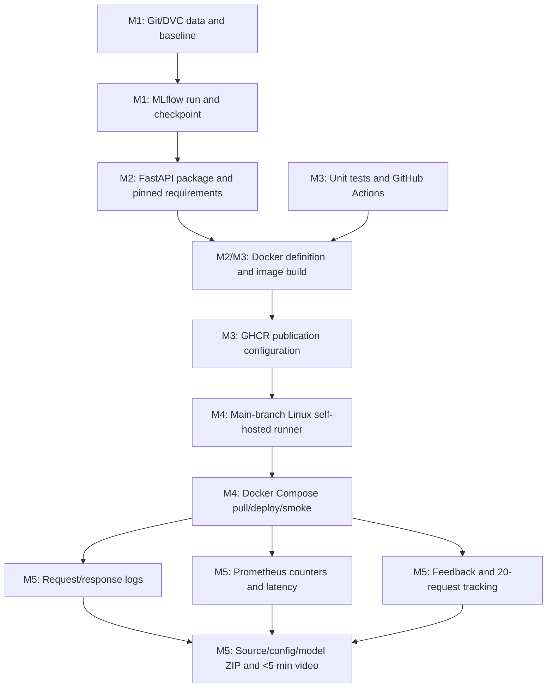

# Assignment 2 Submission Report — End-to-End MLOps Pipeline

> **STALE EVIDENCE NOTICE:** the baseline model was swapped from a small custom CNN to a from-scratch ResNet-50 (`src/cats_dogs_mlops/model.py`, `CatDogResNet50`). Every metric, MLflow run ID, model SHA-256, GHCR digest, and screenshot below still reflects the retired CNN. Re-run `dvc repro`, rebuild/push the Docker image, redeploy, and rerun the post-deployment evaluation to regenerate real evidence before relying on any number in this file.

## Cover information

| Field | Submission value |
|---|---|
| Student name | Hamza Aziz |
| BITS ID | 2024AC05133 |
| Programme | BITS Pilani WILP M.Tech. Artificial Intelligence and Machine Learning |
| Course | MLOps — AIMLCZG523 |
| Assignment | Assignment 2 |
| Semester tag | S2-25 |
| GitHub repository | `https://github.com/hamza-aziz-ai/MLOPs-Cats-Dogs-Pipeline` |
| CI run | `https://github.com/hamza-aziz-ai/MLOPs-Cats-Dogs-Pipeline/actions/runs/31706209711` |
| Container image | `https://github.com/hamza-aziz-ai/MLOPs-Cats-Dogs-Pipeline/pkgs/container/mlops-cats-dogs-pipeline`, digest `sha256:8d6f10f8f231fe565944b5b4bd9bddd0a9a946438c879ccc8572d80578e2e0bf` |
| Submission ZIP | `cats-dogs-mlops-submission.zip`, sha256 `7ad90ed21ed6696cb90f598a1ec9a6c6fd6675b36e317858648cf54e688dbc4d` |

## 1. Source and scope

The authoritative task source used for this implementation is:

`Semester-3/MLOps (S2-25_AIMLCZG523)/Assignments/Assignment-2/Problem-Statement.pdf`

There is a semester-label discrepancy: the course folder and request identify **S2-25**, while the PDF header identifies **S1-25**. The technical work follows the supplied problem statement. Confirmed by the student as **S2-25**; used consistently across the cover page, Git tag, and LMS upload name.

This report documents an end-to-end Cats vs Dogs MLOps baseline and follows the PDF's milestone structure exactly:

1. **M1 — Model Development & Experiment Tracking**
2. **M2 — Model Packaging & Containerization**
3. **M3 — CI Pipeline for Build, Test & Image Creation**
4. **M4 — CD Pipeline & Deployment**
5. **M5 — Monitoring, Logs & Final Submission**

## 2. Executive summary

The completed local pipeline processed 2,000 public images into balanced class partitions at 224 × 224 RGB resolution. A compact CNN was trained for five epochs. Its held-out test accuracy was `0.62` and weighted F1 was `0.6041666667`. The checkpoint was tied to MLflow run `e040fb0dbc64492f96eea1affa576c90` and SHA-256 `8070fc046c4e247d30fa0ec469cd2fd22c1205070c9ddde4121ba540bcc0a793`.

The same preprocessing contract and class ordering are used for inference. Eight automated tests passed with 83% coverage. The Docker image built successfully. The final local Docker Compose stack was verified with both API and Prometheus containers healthy, Prometheus target `http://api:8000/metrics` reporting `up`, and the post-deployment smoke passing. A 20-image request batch against the deployed service produced accuracy `0.7`, weighted F1 `0.6969696970`, mean latency `58.9655750 ms`, and p95 latency `85.8087000 ms`.

The outcome is a functioning and reproducible MLOps pipeline with live CI/CD evidence, not just a local baseline. The predictive performance is moderate and is not overstated. Transfer learning is the primary proposed model improvement. GitHub Actions publication to GHCR and a remote self-hosted deployment are both verified live — see the cover table for the run/job URLs and digest.

## 3. Problem definition

The machine-learning task is closed-set binary image classification:

\[
f(x;\theta) \rightarrow \{\text{cats},\text{dogs}\}.
\]

For output logits \(\mathbf{z}\), softmax gives:

\[
p(y=c\mid x)=\frac{e^{z_c}}{\sum_j e^{z_j}},
\]

and training minimizes cross-entropy:

\[
\mathcal{L}(x,y)=-\log p(y\mid x).
\]

The engineering objective is broader than one score: data, code, configuration, experiments, model artifacts, packaging, CI, deployment, monitoring, logs, and final evidence must be traceable and repeatable.

## 4. Architecture and milestone flow



Key decision: preprocessing and checkpoint metadata are shared between offline and online paths. This reduces training-serving skew and makes the artifact self-describing through class names, image size, model version, metrics, and checksum.

## 5. M1 — Model Development & Experiment Tracking

M1 covers Git/DVC, the baseline model, and MLflow.

### 5.1 Dataset source and provenance

- Dataset handle: `tongpython/cat-and-dog`
- Download implementation: `scripts/download_data.py`
- Reproducibility: `dvc.yaml` and `params.yaml`
- DVC state after reproduction: clean

The preparation stage verifies decodability, applies orientation correction, converts to RGB, center-crops without stretching, resizes to 224 × 224, and stores a SHA-256 content fingerprint in the manifest.

| Property | Value |
|---|---:|
| Total images | 2,000 |
| Training | 1,600 |
| Validation | 200 |
| Test | 200 |
| Image format | RGB |
| Resolution | 224 × 224 |
| Corrupt images skipped | 0 |

The split is deterministic and stratified by class. The manifest supports source-path and content-hash leakage checks.

### 5.2 Transform contract

Training applies random resized crop, horizontal flip, and mild color jitter. Validation, test, and inference use deterministic resizing. All paths use the same normalization:

\[
x'=\frac{x-0.5}{0.5}.
\]

The notebook asserts the `(3, 224, 224)` tensor contract.

### 5.3 Baseline CNN and training

`CatDogResNet50` (`src/cats_dogs_mlops/model.py`) is a from-scratch ResNet-50: a 7x7 stem, then 5 bottleneck stages built from convolutional and identity blocks with skip connections (16 blocks total), average pooling, and a 3-layer fully-connected head to raw logits for cross-entropy loss. No pretrained weights — randomly initialised, per the PDF's "baseline CNN" scope.

| Parameter | Value |
|---|---:|
| Epochs | 5 |
| Image size | 224 |
| Batch size | 32 |
| Learning rate | 0.001 |
| Weight decay | 0.0001 |
| Optimizer | AdamW |
| Loss | Cross-entropy |
| Seed | 42 |

### 5.4 MLflow and held-out results

| Evidence | Value |
|---|---|
| Experiment | `cats-vs-dogs-baseline` |
| Run ID | `e040fb0dbc64492f96eea1affa576c90` |
| Model version | `1.0.0` |
| Model SHA-256 | `8070fc046c4e247d30fa0ec469cd2fd22c1205070c9ddde4121ba540bcc0a793` |

| Metric | Value |
|---|---:|
| Accuracy | 0.62 |
| Weighted precision | 0.6428571429 |
| Weighted recall | 0.62 |
| Weighted F1 | 0.6041666667 |

MLflow records parameters, dataset sizes, device, class ordering, code revision where available, epoch metrics, final metrics, training duration, plots, checkpoint, metrics JSON, and model metadata.

### 5.5 Notebook evidence

`notebooks/01_model_development.ipynb` covers problem understanding, mathematics, provenance, split/leakage checks, preprocessing visualization, model/output checks, training invocation, artifact inspection, evaluation, and limitations. Verified status: **34 cells, 14 code cells executed, zero error outputs, valid nbformat 4.5**. Its checked default `RUN_TRAINING=False` inspects canonical DVC artifacts without launching a duplicate run.

## 6. M2 — Model Packaging & Containerization

M2 covers FastAPI health and predict endpoints, pinned requirements, and Docker/local package verification.

The service loads the trusted checkpoint, uses the shared deterministic preprocessing path, and exposes:

- `/health` for readiness;
- `/predict` for multipart image classification using form field `image`;
- `/metrics` for M5 Prometheus scraping;
- feedback behavior for M5 performance tracking.

The checkpoint loader validates required metadata and uses a weights-only load path. `requirements-api.txt` pins the serving dependencies, while `Dockerfile` defines the repeatable application image.

Local API verification commands:

```powershell
uvicorn cats_dogs_mlops.api:app --host 0.0.0.0 --port 8000
Invoke-RestMethod http://localhost:8000/health
curl.exe -X POST -F "image=@C:\path\to\sample.jpg" http://localhost:8000/predict
```

Do not upload sensitive images.

## 7. M3 — CI Pipeline for Build, Test & Image Creation

M3 covers unit tests, GitHub Actions, Docker image creation, and GHCR publishing.

Verified local evidence:

- Tests passed: **8**
- Coverage: **83%**
- Docker image build: passed locally
- GitHub Actions workflow: present at `.github/workflows/ci-cd.yml`
- GHCR publishing path: configured and verified with a live push (below)

The workflow defines automated quality gates and image creation/publication under its configured events and permissions. Live M3 evidence:

- GitHub repository: `https://github.com/hamza-aziz-ai/MLOPs-Cats-Dogs-Pipeline`
- Successful GitHub Actions run: `https://github.com/hamza-aziz-ai/MLOPs-Cats-Dogs-Pipeline/actions/runs/31706209711`
- GHCR image: `https://github.com/hamza-aziz-ai/MLOPs-Cats-Dogs-Pipeline/pkgs/container/mlops-cats-dogs-pipeline`
- GHCR immutable digest: `sha256:8d6f10f8f231fe565944b5b4bd9bddd0a9a946438c879ccc8572d80578e2e0bf`
- **[SCREENSHOT: TEST/BUILD/PUBLISH JOBS PASSING]**

Coverage is a useful gate but not proof of correctness. Future tests should add corrupt input, load failure, concurrency, resource limits, and rollback behavior.

## 8. M4 — CD Pipeline & Deployment

M4 covers the Docker Compose target and the main-branch Linux self-hosted runner that pulls/deploys the image and performs a post-deployment smoke check.

Verified local M4 evidence:

- `docker-compose.yml` defines the deployment target.
- The final local Compose stack ran with both API and Prometheus containers healthy.
- Prometheus target `http://api:8000/metrics` reported `up`.
- The post-deployment smoke check passed.

The workflow's remote M4 path is configured for a trusted Linux x64 self-hosted runner on the main branch. That runner pulls the published image, deploys it with Docker Compose, and runs the smoke check. A GitHub-hosted runner is ephemeral and cannot be treated as the persistent target host.

Live remote M4 evidence:

- Self-hosted runner: WSL2 Ubuntu 24.04 (x86_64), registered to this repository only, labels `self-hosted`/`linux` matching the workflow's `runs-on`.
- **[SELF-HOSTED RUNNER SCREENSHOT]**
- Successful main-branch deployment job: `https://github.com/hamza-aziz-ai/MLOPs-Cats-Dogs-Pipeline/actions/runs/31706209711/job/94470326140`
- Deployed image digest: `sha256:8d6f10f8f231fe565944b5b4bd9bddd0a9a946438c879ccc8572d80578e2e0bf` (matches the M3 build)
- Remote Compose status: `api` and `prometheus` both `Up`/`healthy`; Prometheus target `cats-dogs-api` reported `up`
- Remote `/health`: `{"status":"ready","model_loaded":true,"model_version":"1.0.0"}`
- Remote `/predict` (real cat image): `{"label":"cats","confidence":0.582,...}`
- **[REMOTE COMPOSE STATUS AND HEALTH/SMOKE SCREENSHOT]**
- Deployment host note: private host — student's own WSL2 Ubuntu self-hosted runner, `http://localhost:8000`, not publicly routable.

The runner is trusted, patched, restricted to the intended repository, and not exposed to untrusted pull-request code or secrets.

## 9. M5 — Monitoring, Logs & Final Submission

M5 covers request/response logs, Prometheus counters/latency, feedback and 20-request performance tracking, the source/config/model ZIP, and a video shorter than five minutes.

### 9.1 Monitoring and logs

The service records request/response activity, exports Prometheus-compatible counters and latency observations, exposes health state, and supports feedback persistence. `monitoring/prometheus.yml` scrapes `http://api:8000/metrics` inside the Compose network. In the final local verification, both containers were healthy and this target reported `up`.

Recommended panels/alerts include request rate, error rate, mean/p95/p99 latency, confidence/class distribution, invalid-image rate, active model version/checksum, feedback coverage, delayed accuracy, container restarts, CPU, and memory.

### 9.2 Post-deployment performance tracking

| Metric | Value |
|---|---:|
| Labelled requests | 20 |
| Accuracy | 0.7 |
| Weighted F1 | 0.6969696970 |
| Mean latency | 58.9655750 ms |
| P95 latency | 85.8087000 ms |

The deployed accuracy is at or above the offline test accuracy (0.62), which supports basic train/serve consistency, but 20 requests are too few for a production guarantee — a different random 20-request sample would likely land elsewhere given the offline test set's own variance.

### 9.3 Final submission package

The documentation and a 4:40 video script are ready. Delivered:

- source, configuration, and model artifact ZIP: `cats-dogs-mlops-submission.zip`, sha256 `7ad90ed21ed6696cb90f598a1ec9a6c6fd6675b36e317858648cf54e688dbc4d`;
- identity and semester confirmation: Hamza Aziz, 2024AC05133, S2-25;
- live M3/M4 URLs and digest (verified, see cover table).

Still required: the final video recording under five minutes, and required screenshots.

Do not include secrets, `.env`, `.venv`, unnecessary raw data, private logs, or cached dependencies in the ZIP.

## 10. Exact M1–M5 evidence matrix

| PDF milestone | Evidence delivered | Verified status | Manual/live evidence still required |
|---|---|---|---|
| **M1 — Model Development & Experiment Tracking** | Git-ready source; DVC pipeline/clean status; dataset provenance; five-epoch baseline; notebook; MLflow run; metrics/plots/checkpoint | Complete | MLflow/DVC screenshots |
| **M2 — Model Packaging & Containerization** | FastAPI `/health` and `/predict`; shared inference contract; pinned API requirements; Dockerfile/local package verification; live `/health` and `/predict` against the deployed container | Complete | Final API/package screenshot |
| **M3 — CI Pipeline for Build, Test & Image Creation** | Eight tests/83% coverage; GitHub Actions workflow; Docker image build; live GHCR publish | Complete — repository URL, CI run URL, GHCR digest all verified | Screenshots |
| **M4 — CD Pipeline & Deployment** | Compose target; main-branch Linux self-hosted runner (WSL2 Ubuntu) pull/deploy/smoke; live two-container healthy stack and smoke | Complete — live deployment job URL, deployed digest, and remote health/predict all verified | Screenshots |
| **M5 — Monitoring, Logs & Final Submission** | Request/response logging; Prometheus counters/latency and `up` target; feedback; 20-request evaluation; report/checklist; 4:40 script; checksummed submission ZIP | Complete except video | Final video recording, screenshots |

## Evidence screenshots

Captured directly from this run's live state (browser automation for web UIs; rendered from genuine command output for CLI evidence — this environment has no interactive terminal to literally screen-capture). Files live in `docs/screenshots/`.

| ID | Evidence | Screenshot |
|---|---|---|
| E1 | Final commit | `docs/screenshots/E1_repo_commit.png` |
| E2 | `dvc status` clean | `docs/screenshots/E2_dvc_status.png` |
| E3 | 2,000-image dataset, 1,600/200/200 split | `docs/screenshots/E3_dataset_split.png` |
| E4 | Executed notebook: 34 cells, 14 code executed, 0 errors | `docs/screenshots/E4_notebook_executed.png` |
| E5 | MLflow run `e040fb0dbc64492f96eea1affa576c90` | `docs/screenshots/E5_mlflow_run.png` |
| E6 | MLflow run artifacts (plots, checkpoint) | `docs/screenshots/E6_mlflow_artifacts.png` (also `artifacts/confusion_matrix.png`, `artifacts/loss_curves.png` directly) |
| E7 | FastAPI `/health` and `/predict` | `docs/screenshots/E7_health.png`, `docs/screenshots/E7_predict.png` |
| E8 | 8 tests passed, 83% coverage | `docs/screenshots/E8_pytest_coverage.png` |
| E9 | Docker image built | `docs/screenshots/E9_docker_images.png` |
| E10 | Live GitHub Actions run and GHCR package | `docs/screenshots/E10_github_actions_run.png`, `docs/screenshots/E10_ghcr_package.png` |
| E11 | Both Compose containers healthy | `docs/screenshots/E11_compose_healthy.png` |
| E12 | Self-hosted runner online, deploy job succeeded | `docs/screenshots/E12_runner_online.png` |
| E13 | Request/response logs and feedback predictions (no PII) | `docs/screenshots/E13a_request_logs.png`, `docs/screenshots/E13b_feedback_predictions.png` |
| E14 | Prometheus target `cats-dogs-api` reporting `up` | `docs/screenshots/E14_prometheus_target_up.png` |
| E15 | 20-request post-deployment performance | `docs/screenshots/E15_post_deployment.png` |
| E16 | Submission ZIP contents/checksum | `docs/screenshots/E16_zip_contents.png` |

Not captured: the final video recording (requires screen/audio recording, outside this environment's capability).

## 11. Limitations and improvement plan

### Current limitations

1. Test accuracy `0.62` and weighted F1 `0.6041666667` are moderate.
2. The network is trained from scratch on a capped 2,000-image dataset.
3. Aggregate weighted metrics may hide class-specific weaknesses.
4. The closed-set classifier must choose cat or dog for unrelated images.
5. The deployment evaluation has only 20 labelled requests.
6. Local MLflow/Prometheus/Compose evidence is appropriate for the assignment baseline, not a multi-user production platform.
7. Reproducibility seeds do not guarantee bitwise equality across GPU drivers and hardware.

### Primary improvement: transfer learning

The next controlled experiment should use MobileNetV3 or EfficientNet pretrained on ImageNet. Train a new head with the backbone frozen, then fine-tune final blocks at a lower learning rate. Keep the identical DVC split and log both runs to MLflow. Compare accuracy, per-class precision/recall/F1, calibration, latency, model size, and CPU memory. Promote only if a predeclared quality gate is met without violating the latency budget.

Further improvements include confidence calibration, out-of-distribution rejection, data-slice evaluation, larger external test data, drift analysis, a model registry, signed images/SBOM, vulnerability scanning, and automated rollback.

## 12. Reproduction commands

Use Python 3.11 or 3.12.

```powershell
py -3.12 -m venv .venv
.\.venv\Scripts\Activate.ps1
python -m pip install --upgrade pip
python -m pip install -r requirements.txt
python -m pip install -e .

dvc repro
dvc status
pytest --cov=cats_dogs_mlops --cov-report=term-missing
jupyter nbconvert --execute --to notebook --inplace notebooks\01_model_development.ipynb

mlflow ui --backend-store-uri file:./mlruns --port 5000
uvicorn cats_dogs_mlops.api:app --host 0.0.0.0 --port 8000
curl.exe -X POST -F "image=@C:\path\to\sample.jpg" http://localhost:8000/predict

docker build -t cats-dogs-mlops:local .
docker compose up --build -d
docker compose ps
python scripts/post_deployment_evaluation.py --base-url http://localhost:8000
docker compose down
```

## 13. Final evidence placeholders

- Hamza Aziz
- 2024AC05133
- S2-25
- `https://github.com/hamza-aziz-ai/MLOPs-Cats-Dogs-Pipeline`
- `https://github.com/hamza-aziz-ai/MLOPs-Cats-Dogs-Pipeline/actions/runs/31706209711`
- `https://github.com/hamza-aziz-ai/MLOPs-Cats-Dogs-Pipeline/pkgs/container/mlops-cats-dogs-pipeline`
- `sha256:8d6f10f8f231fe565944b5b4bd9bddd0a9a946438c879ccc8572d80578e2e0bf`
- `https://github.com/hamza-aziz-ai/MLOPs-Cats-Dogs-Pipeline/actions/runs/31706209711/job/94470326140`
- `cats-dogs-mlops-submission.zip`, sha256 `7ad90ed21ed6696cb90f598a1ec9a6c6fd6675b36e317858648cf54e688dbc4d`
- **[VIDEO URL OR FILENAME]**
- **[SCREENSHOT: DVC REPRO AND CLEAN STATUS]**
- **[SCREENSHOT: MLFLOW RUN e040fb0dbc64492f96eea1affa576c90]**
- **[SCREENSHOT: TEST METRICS AND PLOTS]**
- **[SCREENSHOT: PYTEST 6 PASSED / 83% COVERAGE]**
- **[SCREENSHOT: DOCKER IMAGE BUILD]**
- **[SCREENSHOT: API HEALTH AND PREDICTION]**
- **[SCREENSHOT: BOTH COMPOSE CONTAINERS HEALTHY]**
- **[SCREENSHOT: PROMETHEUS TARGET http://api:8000/metrics UP]**
- **[SCREENSHOT: POST-DEPLOYMENT RESULTS]**
- **[SCREENSHOT: ACTIONS, GHCR, AND REMOTE RUNNER — ONLY AFTER LIVE VERIFICATION]**

## 14. Conclusion

The assignment delivers a coherent local lifecycle aligned with the PDF milestones: M1 makes model development traceable, M2 packages the inference service, M3 defines and locally verifies the test/build path, M4 verifies the Compose target locally and configures—but does not falsely claim—the remote main-branch deployment, and M5 provides monitoring, logs, performance tracking, and final-submission materials. The baseline's moderate quality is visible and leads to an academically defensible next step: controlled transfer learning followed by evidence-based promotion.
